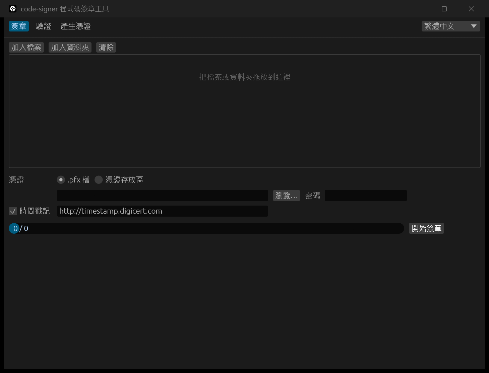

# code-signer

[](https://github.com/tntrock/code-signer/actions/workflows/ci.yml)

**繁體中文** · [English](#english)

Windows 用的 Authenticode 程式碼簽章工具。單一 exe，同時提供圖形介面與命令列，介面可切換繁體中文 / English。



## 功能

- **簽章**：`.exe` `.dll` `.sys` `.ocx` `.msi` `.cab` `.cat` `.ps1` `.psm1`，SHA-256
- **時間戳記**：RFC 3161（預設 `http://timestamp.digicert.com`），憑證過期後簽章仍有效
- **批次**：一次處理多個檔案或整個資料夾；單一檔案失敗不影響其他檔案
- **驗證**：顯示簽章狀態、簽章者、時間戳記與憑證鏈
- **產生自簽憑證**：帶程式碼簽章用途的 RSA 憑證，匯出 `.pfx`，可選擇加入本機信任清單以便測試
- **憑證來源**：`.pfx` 檔，或 Windows 憑證存放區（以指紋指定）
- 直接呼叫 Windows 原生簽章 API，**不需要安裝 Windows SDK / signtool**
- 簽章失敗時原檔不會被改動；不儲存任何密碼

## 下載

到 [Releases](https://github.com/tntrock/code-signer/releases) 下載 `code-signer.exe`，免安裝。可用同頁的 `.sha256` 檔核對雜湊值。

## 圖形介面

直接雙擊 `code-signer.exe`。

1. **產生憑證**分頁：填入名稱、密碼與輸出路徑後按「產生」。勾選「同時匯入本機信任清單」時，Windows 會跳出安全性確認視窗
2. **簽章**分頁：把檔案或資料夾拖進視窗，選擇憑證、輸入密碼，按「開始簽章」
3. **驗證**分頁：把檔案拖進視窗即自動驗證，點選檔案可看詳細資訊

## 命令列

```powershell
# 產生自簽憑證（密碼從環境變數讀取；未指定 --password-env 時會提示輸入）
$env:PFX_PW = "your-password"
code-signer new-cert --cn "My Company Test" --out test.pfx --password-env PFX_PW

# 簽章（含時間戳記），資料夾遞迴
code-signer sign .\dist -r --pfx test.pfx --password-env PFX_PW --timestamp

# 使用憑證存放區中的憑證
code-signer sign app.exe --thumbprint A1B2C3... --timestamp

# 驗證，並輸出 JSON
code-signer verify app.exe --json
```

| Exit code | 意義 |
|---|---|
| 0 | 全部成功（verify：全部簽章有效） |
| 1 | 至少一個檔案失敗（verify：有未簽章或簽章無效的檔案） |
| 2 | 參數、憑證或其他前置錯誤，沒有處理任何檔案 |

語言：`--lang zh-TW|en`，或設定環境變數 `CODE_SIGNER_LANG`；預設依 Windows 顯示語言。`--json` 的欄位名稱與 `status` 代碼固定為英文。

## 關於自簽憑證

自簽憑證只在**信任它的電腦**上會顯示「簽章有效」，其他電腦會顯示「根憑證不受信任」，SmartScreen 也不會因此信任你的程式。要公開發佈，請向 CA 購買程式碼簽章憑證，再用本工具的「憑證存放區」或 `.pfx` 模式簽章。

測試完畢後，可在「管理使用者憑證」（`certmgr.msc`）的「受信任的根憑證授權單位」與「受信任的發行者」中刪除測試憑證。

## 從原始碼建置

需要 Rust（stable）與 Windows 上的 MSVC 工具鏈。

```powershell
cargo build --release     # 產物：target\release\code-signer.exe
cargo test                # 單元 + 整合測試
cargo test -- --ignored   # 需要網路的時間戳記測試
```

## 授權

MIT 或 Apache-2.0，擇一使用。

---

<a id="english"></a>

## English

A Windows Authenticode code signing tool. One exe with both a GUI and a CLI; the interface is available in Traditional Chinese and English.

### Features

- **Sign** `.exe` `.dll` `.sys` `.ocx` `.msi` `.cab` `.cat` `.ps1` `.psm1` with SHA-256
- **Timestamp** via RFC 3161 (default `http://timestamp.digicert.com`) so signatures outlive the certificate
- **Batch** many files or whole folders; one failure does not stop the rest
- **Verify** status, signer, timestamp and certificate chain
- **Create self-signed certificates** (RSA, Code Signing EKU) as `.pfx`, optionally trusted on this PC for testing
- **Certificate sources**: a `.pfx` file or the Windows certificate store (by thumbprint)
- Calls the native Windows signing APIs — **no Windows SDK / signtool required**
- The original file is untouched if signing fails; passwords are never stored

### Download

Get `code-signer.exe` from [Releases](https://github.com/tntrock/code-signer/releases). No installation needed. Check it against the `.sha256` file on the same page.

### GUI

Double-click `code-signer.exe`.

1. **New certificate** tab: enter a name, password and output path, then click Generate. If you tick "Also trust it on this PC", Windows shows a security prompt
2. **Sign** tab: drop files or folders onto the window, pick a certificate, enter its password and click Sign
3. **Verify** tab: drop files to verify them; click a file for details

### CLI

```powershell
# Create a self-signed certificate (password from an environment variable; prompts if --password-env is omitted)
$env:PFX_PW = "your-password"
code-signer new-cert --cn "My Company Test" --out test.pfx --password-env PFX_PW

# Sign a folder recursively with a timestamp
code-signer sign .\dist -r --pfx test.pfx --password-env PFX_PW --timestamp

# Use a certificate from the Windows store
code-signer sign app.exe --thumbprint A1B2C3... --timestamp

# Verify and print JSON
code-signer verify app.exe --json
```

| Exit code | Meaning |
|---|---|
| 0 | Everything succeeded (verify: all signatures valid) |
| 1 | At least one file failed (verify: unsigned or invalid signature) |
| 2 | Argument, certificate or other setup error; no files were processed |

Language: `--lang zh-TW|en` or the `CODE_SIGNER_LANG` environment variable; defaults to the Windows display language. `--json` field names and `status` codes are always English.

### About self-signed certificates

A self-signed certificate only shows as valid on PCs that **trust it**; elsewhere Windows reports an untrusted root, and SmartScreen will not trust your program because of it. For public releases, buy a code signing certificate from a CA and sign with this tool's certificate store or `.pfx` mode.

After testing, remove the test certificate from "Trusted Root Certification Authorities" and "Trusted Publishers" in `certmgr.msc`.

### Building from source

Requires stable Rust and the MSVC toolchain on Windows.

```powershell
cargo build --release     # output: target\release\code-signer.exe
cargo test                # unit + integration tests
cargo test -- --ignored   # networked timestamp test
```

### License

Licensed under either MIT or Apache-2.0, at your option.
